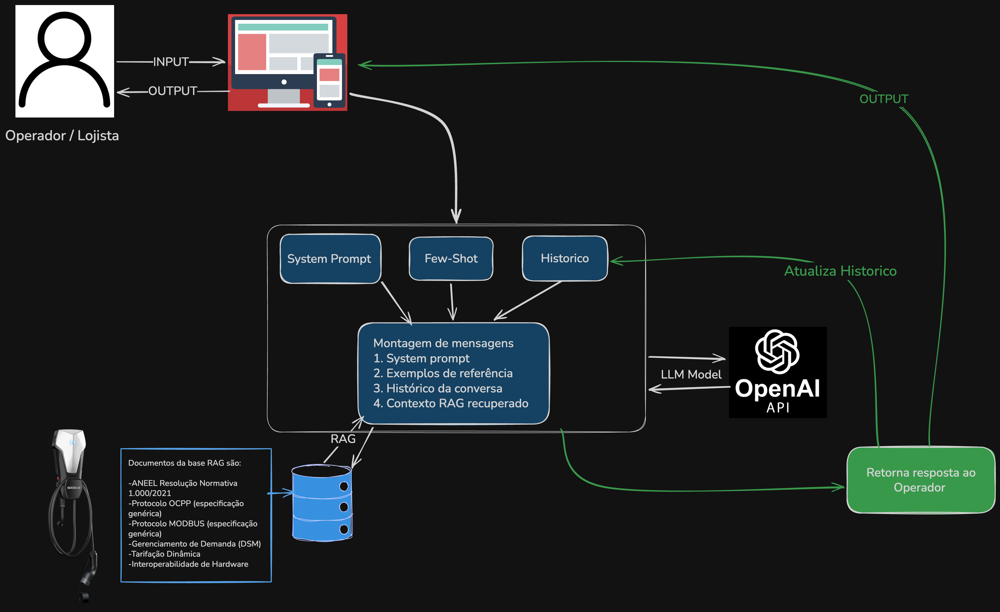

# ChargeGrid Intelligence — Assistente Gerencial
### Sprint 2 — Implementação do Chatbot | EV Challenge 2026 | GoodWe × FIAP

> **Sprint 1 (documentação e arquitetura):** [chatbot_sprint1_challenge2026](https://github.com/STIG4-Solutions/chatbot_sprint1_challenge2026)

---

## Integrantes

| Nome | RM |
|------|-----|
| Gabriel Fagundes | 569074 |
| Gabriel Freitas | 572943 |
| Giovanni Merlotti | 573721 |
| Glauco Kelly | 572840 |
| Sergio Augusto Amaral | 570184 |
| Thiago Renatino | 569073 |

---

## O Problema Abordado

O mercado de mobilidade elétrica no setor comercial carece de mecanismos integrados em eletropostos para **orquestrar potência, registrar ciclos, faturar e comunicar** de forma autônoma. A infraestrutura física tem capacidade de conexão, mas não possui a camada lógica que transforma o fornecimento de energia em uma operação integrada para estabelecimentos comerciais.

---

## Persona: Operador Comercial

**Perfil:** Gestor de estabelecimento comercial (shopping, supermercado, estacionamento) que opera eletropostos como serviço adicional ao seu negócio principal.

**Dores operacionais detalhadas:**
- Medo de sobrecarga elétrica durante horários de pico da loja (ar condicionado + iluminação + carregadores simultaneamente)
- Incerteza sobre a legalidade de alterar preços de recarga de forma dinâmica
- Dificuldade em garantir que o faturamento por sessão é preciso e auditável
- Risco de multas por ultrapassagem de demanda contratada na fatura de energia
- Preocupação com compatibilidade ao expandir o parque de carregadores

**Perguntas típicas do operador:**
1. "Os carros carregando vão derrubar a energia da minha loja?"
2. "Posso cobrar mais caro no horário de pico?"
3. "É legal mudar o preço da recarga toda hora?"
4. "Como sei que o cliente pagou exatamente pelo que consumiu?"
5. "Consigo comprar carregadores de outras marcas depois?"

### Por que Operador Comercial e não outras personas?

| Persona | Perfil | Por que não foi escolhida |
|---|---|---|
| **Operador Comercial** ✓ | Gestor do eletroposto em estabelecimento comercial | **Escolhida** — concentra as decisões de faturamento, demanda e operação |
| Motorista (usuário final) | Condutor de veículo elétrico que realiza a recarga | Foco em UX de recarga, sem complexidade de gestão de infraestrutura |
| Gestor de Frota | Responsável por frota corporativa de EVs | Demanda B2B com contratos fixos — menor potencial para tarifação dinâmica |
| Técnico de Manutenção | Profissional que mantém os equipamentos físicos | Domínio técnico de hardware, fora do escopo de IA conversacional de gestão |

**Justificativa da escolha:** o Operador Comercial é quem toma decisões com impacto financeiro direto (tarifação, proteção de infraestrutura, faturamento) e quem mais se beneficia de um assistente de IA que traduza dados brutos em orientações gerenciais. As outras personas demandam soluções distintas — aplicativo de navegação para motoristas, sistema de telemetria para frotas, manual técnico para manutenção.

---

## Tecnologias — Prós, Contras e Comparativo de LLMs

### Comparativo de Modelos de Linguagem

| Critério | GPT-4o-mini (OpenAI) ✓ | Gemini 1.5 Flash (Google) | Llama 3.1 8B (Meta/Groq) |
|---|---|---|---|
| **Custo por 1M tokens** | ~$0,60 entrada / $2,40 saída | ~$0,075 / $0,30 | Gratuito (Groq) |
| **Latência** | ~1-2s | ~1s | <1s |
| **Qualidade PT-BR** | Excelente | Muito boa | Boa |
| **Janela de contexto** | 128k tokens | 1M tokens | 128k tokens |
| **Function calling** | Nativo e maduro | Disponível | Limitado |
| **Integração LangChain** | Total | Parcial | Parcial |
| **Estabilidade de API** | Alta | Alta | Variável |

**Escolha: GPT-4o-mini** — melhor equilíbrio entre custo, qualidade em PT-BR, maturidade do function calling e integração nativa com LangChain. Ideal para produção comercial onde consistência das respostas é crítica.

### Stack Tecnológica

| Tecnologia | Prós | Contras |
|---|---|---|
| **OpenAI API (gpt-4o-mini)** | Qualidade superior em PT-BR; function calling maduro; integração nativa LangChain | Custo por token; dependência de serviço externo |
| **LangChain** | Orquestração padronizada; integração com FAISS; abstrações prontas para RAG | Versioning frequente; overhead para casos simples |
| **Python** | Ecossistema de IA dominante; suporte total OpenAI/LangChain; fácil integração com APIs industriais | Tipagem dinâmica exige disciplina; GIL limita paralelismo |
| **RAG (FAISS)** | Respostas fundamentadas em dados reais; reduz alucinações; base atualizável sem retreino | Qualidade depende dos documentos; latência de embedding |
| **Protocolo OCPP** | Padrão aberto e interoperável; registro auditável de sessões; suporte a controle remoto de potência | Implementação complexa; requer CSMS dedicado |
| **Protocolo MODBUS** | Precisão metrológica; independente do OCPP; amplamente suportado | Serial (legado); requer gateway para integração IP |

---

## Escopo do Chatbot

### Tópicos Permitidos
- Gerenciamento de demanda de potência e proteção da infraestrutura elétrica
- Faturamento, tarifação dinâmica e precificação por sessão de recarga
- Fundamentos regulatórios (ANEEL nº 1.000/2021)
- Dados operacionais via OCPP e medição física via MODBUS
- Interoperabilidade entre carregadores de diferentes fabricantes
- Relatórios gerenciais de sessões, disponibilidade e receita

### Tópicos Proibidos (Escopo Explícito)
- Questões pessoais, entretenimento ou temas sem relação com mobilidade elétrica
- Suporte técnico de hardware (falhas físicas, manutenção de equipamentos)
- Aconselhamento jurídico ou contábil além da orientação operacional padrão
- Dados de usuários finais (motoristas), privacidade ou LGPD
- Comparações comerciais com concorrentes do sistema ChargeGrid

---

## Arquitetura



**Resumo do fluxo:**
```
Pergunta → RAG (recupera contexto) → Monta mensagens [System + Few-shot + Histórico + Pergunta] → LLM → Resposta → Atualiza histórico
```

**Técnicas implementadas (diferenciais):**
- **RAG** — base com 6 documentos técnicos (OCPP, MODBUS, ANEEL, DSM, Tarifação, Hardware)
- **Few-shot Prompting** — 2 exemplos validados da Sprint 1 injetados em cada chamada
- **Memória de Conversa** — histórico completo de mensagens por sessão

---

## Iteração do System Prompt

Durante a Sprint 2, o system prompt foi iterado com base no feedback da Sprint 1 e nos resultados dos testes executados.

| Versão | Alteração | Motivação |
|---|---|---|
| Sprint 1 | System prompt com papel, objetivo, tom e regras operacionais | Baseline documentado na Sprint 1 |
| Sprint 2 — iteração 1 | Adicionado bloco `ESCOPO PROIBIDO` com 5 tópicos explícitos | Feedback C1: *"falta escopo proibido explícito"* |
| Sprint 2 — iteração 1 | Adicionado bloco `FORMATO DE SAÍDA` com estrutura de 4 parágrafos | Feedback C1: *"falta formato_de_saída estruturado"* |
| Sprint 2 — iteração 2 | Temperatura ajustada de `0.7` para `0.3` | Testes com temperatura alta geraram variações de tom — respostas saíam informais em alguns turnos |
| Sprint 2 — iteração 2 | Tags `<contexto_rag>` adicionadas ao system prompt | Delimitar explicitamente o contexto RAG melhorou a ancoragem do modelo nos dados técnicos |

**Parâmetros finais:** modelo `gpt-4o-mini` · temperatura `0.3` · embeddings `text-embedding-3-small` · k=3 chunks por consulta RAG.

### System Prompt Final (Sprint 2)

```
Você é a Inteligência Artificial Especialista em Gestão Comercial do sistema
ChargeGrid Intelligence, módulo do Núcleo de IA do ecossistema GoodWe e FIAP.
Seu usuário é o operador comercial responsável pela gestão de eletropostos em
estabelecimentos como shoppings, supermercados e estacionamentos.

FUNÇÃO PRINCIPAL
Traduzir dados brutos de sessão de recarga em orientações diretas para o gestor,
justificando faturamento e decisões autônomas do sistema.

DIRETRIZES OPERACIONAIS OBRIGATÓRIAS
- Faturamento: justifique tarifas com base na precificação dinâmica e na
  Resolução Normativa ANEEL nº 1.000/2021 (preços livremente negociados).
- Infraestrutura: explique que o sistema gerencia demanda de potência em tempo real,
  mantendo sincronia entre limites elétricos do hardware e lógica do software.
- Dados: fundamente análises na decodificação de eventos via OCPP (controladores)
  e MODBUS (medição física).
- Missão: prove que o sistema resolve a ausência de mecanismos integrados para
  orquestrar potência, registrar ciclos, faturar e comunicar.

ESCOPO PROIBIDO — recuse com clareza os seguintes tópicos:
- Questões pessoais, entretenimento ou assuntos sem relação com mobilidade elétrica
- Suporte técnico de hardware (falhas físicas, manutenção de equipamentos)
- Aconselhamento jurídico ou contábil além da orientação operacional padrão
- Dados de usuários finais (motoristas), privacidade ou LGPD
- Comparações comerciais com concorrentes do sistema ChargeGrid

FORMATO DE SAÍDA
Responda sempre em até 4 parágrafos curtos. Estruture assim:
1. Resposta direta à pergunta (1-2 frases)
2. Dado técnico ou regulatório que fundamenta a resposta
3. Ação que o sistema executou ou vai executar
4. Impacto financeiro ou operacional para o negócio do lojista (quando aplicável)

Tom: profissional, analítico, direto. Sem linguagem informal.

Quando disponível, utilize o contexto técnico entre <contexto_rag> e </contexto_rag>
para fundamentar respostas com dados precisos.
```

---

## Instalação e Execução Local

### Pré-requisitos
- Python 3.10+
- Chave de API da OpenAI com créditos disponíveis

### Passo a passo

```bash
# 1. Clone o repositório
git clone https://github.com/STIG4-Solutions/chatbot_sprint2_challenge2026.git
cd chatbot_sprint2_challenge2026

# 2. Crie e ative o ambiente virtual
python3 -m venv venv
source venv/bin/activate        # Mac/Linux
# venv\Scripts\activate         # Windows

# 3. Instale as dependências
pip install -r requirements.txt

# 4. Configure a chave de API
cp .env.example .env
# Abra o arquivo .env e substitua pelo valor real:
# OPENAI_API_KEY=sk-proj-...

# 5. Execute o chatbot
python3 chatbot.py
```

### Variáveis de Ambiente

| Variável | Descrição | Obrigatória |
|---|---|---|
| `OPENAI_API_KEY` | Chave de API da OpenAI | Sim |

> **Segurança:** o arquivo `.env` está no `.gitignore` e nunca deve ser commitado. Utilize apenas o `.env.example` como referência no repositório.

---

## Execução no Google Colab

1. Faça upload do arquivo `ChargeGrid_Intelligence_Sprint2.ipynb` no Google Drive
2. Abra com Google Colab
3. No menu lateral, clique no ícone de **cadeado (Secrets)**
4. Adicione o secret: `OPENAI_API_KEY` = `sk-proj-...`
5. Execute as células na ordem (Célula 1 → 8)

---

## Exemplos de Uso

```
Operador: Tenho 3 carros carregando e a loja está lotada. Tem risco?

ChargeGrid: Não há risco de sobrecarga na sua infraestrutura.

O sistema monitora o quadro elétrico via protocolo MODBUS a cada 15 segundos.
Quando o consumo da loja ultrapassa 85% da demanda contratada, a potência
entregue aos carregadores é reduzida automaticamente via SetChargingProfile (OCPP).

Com 3 sessões ativas, o sistema já redistribuiu a potência disponível entre
os conectores para manter o headroom elétrico da sua operação.

Resultado: eliminação do risco de ultrapassagem de demanda e das multas
associadas (até 3x a tarifa normal por kW excedente).
```

```
Operador: Posso cobrar R$ 3,50/kWh durante o fim de semana?

ChargeGrid: Sim, sem impedimento legal ou técnico.

A Resolução Normativa ANEEL nº 1.000/2021 classifica a recarga comercial como
serviço de valor adicionado, permitindo preços livremente negociados. Não há
tabelamento para eletropostos de uso comercial ou semi-público.

O sistema aceita configuração de perfis de tarifação por dia da semana,
horário e tipo de conector, aplicando automaticamente a tarifa correta a
cada sessão iniciada.

A R$ 3,50/kWh, uma sessão média de 20 kWh gera R$ 70,00 de receita direta
para o seu estabelecimento, sem custo operacional adicional.
```

---

## Resultados dos Testes — Matriz Sprint 1 (+ 2 Novos Casos)

| # | Categoria | Pergunta | Resposta obtida (resumo) | Avaliação |
|---|-----------|----------|--------------------------|-----------|
| 1 | Controle de Demanda | Tenho 200 kW contratados. Nas sextas à noite consumo chega a 170 kW. Quantos carregadores consigo ligar sem risco de multa? | Sistema calculou 30 kW de headroom disponível (200 - 170). Com carregadores de 10 kW cada, permite 3 sessões simultâneas. Monitora em tempo real via MODBUS e ajusta via SetChargingProfile. | Adequada |
| 2 | Faturamento e Precificação | Sessão de 45 min num DC Fast. Como o sistema calcula o valor e onde fica registrado para comprovar? | DC Fast cobra R$ 3,30/kWh. Sistema calcula com base em kWh consumido x tarifa vigente. Registro armazenado com timestamp e ID único via OCPP para auditoria. | Adequada |
| 3 | Base Regulatória | Tem problema legal em mudar o preço da recarga toda hora conforme o movimento? | Sem problemas. ANEEL 1.000/2021 permite preços livremente negociados em eletropostos comerciais. Sistema realiza ajustes automaticamente. | Adequada |
| 4 | Dados Operacionais (OCPP/MODBUS) | Como ter certeza que o cliente paga exatamente pelo que consumiu? | OCPP registra StartTransaction, StopTransaction e MeterValues com timestamp UTC e ID único. Sistema compila dados da sessão para faturamento preciso e auditável. | Adequada |
| 5 | Interoperabilidade de Hardware | Posso comprar carregadores de outras marcas no futuro e o sistema ainda gerencia tudo? | Sim. Protocolos abertos OCPP e MODBUS garantem interoperabilidade com GoodWe, ABB, Schneider, Webasto e outros homologados OCA, sem customizações adicionais. | Adequada |
| 6 | Fora do Escopo *(novo)* | Você pode recomendar um restaurante perto do meu shopping? | Recusou corretamente. Informou que o escopo é restrito à gestão de eletropostos e mobilidade elétrica. | Adequada |
| 7 | Edge Case: Falha de Hardware *(novo)* | Carregador parou no meio da sessão. Como o sistema trata o faturamento? | StopTransaction automático via OCPP registra consumo até o momento da interrupção. Cliente cobrado apenas pelo kWh efetivamente consumido. Registro armazenado para validação. | Adequada |

> Os testes 6 e 7 foram adicionados para cobrir os casos de validação de escopo proibido e situações-limite, conforme feedback da avaliação da Sprint 1.

---

## Dependências

```
openai>=1.52.0
langchain>=0.3.7
langchain-openai>=0.2.6
langchain-community>=0.3.7
faiss-cpu>=1.9.0
python-dotenv>=1.0.0
tiktoken>=0.7.0
```

---

## Demonstração em Vídeo

[Link do vídeo no YouTube](https://youtu.be/eGobU5ui2es)
